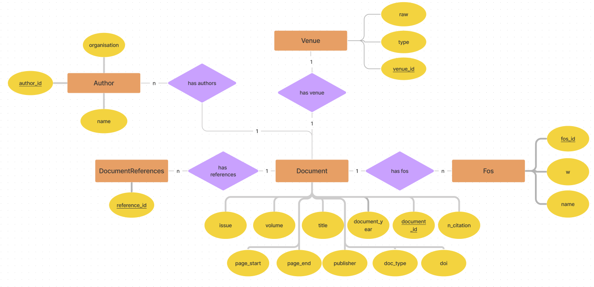
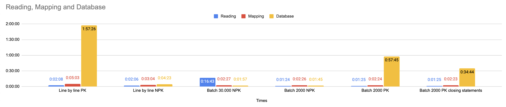
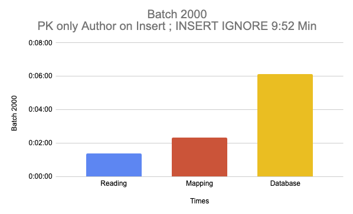
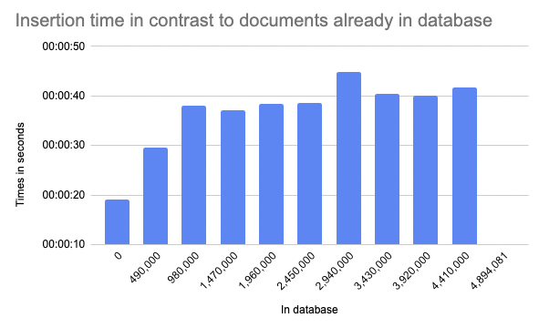
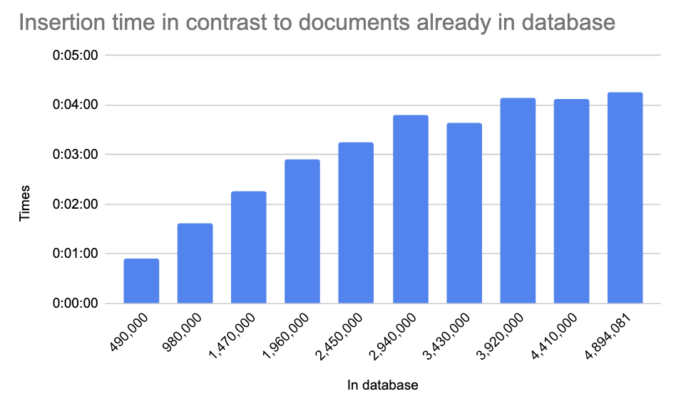

# ER-Model

# Experiments

# Best time
Whole run: PT9M52.869128375S

| Category  | Time             |
|-----------|------------------|
| Reading:  | PT1M23.600975666S |
| Mapper:   | PT2M21.632286758S |
| Database: | PT6M7.617062451S |
| Full duration: |  PT9M52.850324875S  |

| percent | time |
|---------|------|
| 0       |   PT19.067868495S   |
| 10      |  PT29.483393047S    |
| 20      |  PT38.070882667S    |
| 30      |   PT37.058043204S   |
| 40      |    PT38.366433626S   |
| 50      |    PT38.520973337S  |
| 60      |  PT44.916658244S    |
| 70      |   PT40.451754915S   |
| 80      |   PT40.049862287S   |
| 90      |    PT41.631192629S  |

# More

## Run Batch 2000 PK ; Closing Statements

# Weitere

#### With primary key

**Line by line**

* Reading:  PT2M7.671678336S
* Mapping:  PT5M2.835406784S
* Database: **PT1H57M25.672997672S**

____________________
**Batch-size 2000**

* Reading:  PT1M25.3264669500:7S
* Mapper:   PT2M24.925795539S
* Database: **PT57M45.090075337S**

____________________

#### Without primary key

**Line by line**

* Reading:  PT2M6.677826749S
* Mapper:   PT3M3.932686967S
* Database: PT4M22.576597867S

____________________
**Batch 30000**

* Reading:  PT16M43.311525128S
* Mapper:   PT2M27.294697208S
* Database: PT1M57.304109706S

____________________

## Batch list size test

**Batch-size: 3000**  
PT1M50.620178708S

**Batch-size 5000**  
2:48

**Batch-size 2000**  
PT1M23.155650667S

batch 2000 with closing statements  
All: PT34M43.553103167S

* Reading:  PT1M25.398335878S
* Mapper:   PT2M22.937630479S
* Database: PT30M55.173235435S
     

* 00:00:53.745369916
* 00:01:37.116991123
* 00:02:16.236149135
* 00:02:54.039645535
* 00:03:14.60545555
* 00:03:48.635628204
* 00:03:38.577812341
* 00:04:08.544681171
* 00:04:08.167872007
* 00:04:15.503630453

* 1 = PT53.745369916S
* 2 = PT1M37.116991123S
* 3 = PT2M16.236149135S
* 4 = PT2M54.039645535S
* 5 = PT3M14.60545555S
* 6 = PT3M48.635628204S
* 7 = PT3M38.577812341S
* 8 = PT4M8.544681171S
* 9 = PT4M8.167872007S
* 10 = PT4M15.503630453S

#### batch 1000

* Reading:  PT1M11.082698181S
* Mapper:   PT2M57.582445118S
* Database: PT38M51.996517951S
* Full duration: PT43M0.66166125S

database only

* one : PT1M9.819477516S
* two : PT1M27.739510666S
* three : PT2M22.367926832S
* four : PT2M37.504864216S
* five : PT3M22.102751913S
* six : PT3M53.324853378S
* seven : PT6M15.475524422S
* eight : PT5M35.717439828S
* nine : PT6M0.213184342S
* ten : PT6M7.730984838S

#### no pk, one connection commit, 2000, ignore

* Reading:  PT1M25.621530184S
* Mapper:   PT2M24.098499185S
* Database: PT6M46.824923089S
* Full duration: PT10M36.544952458S
     
* one : PT21.94077212S
* two : PT32.540060084S
* three : PT37.766419816S
* four : PT40.585480576S
* five : PT42.459673378S
* six : PT44.138580633S
* seven : PT48.755946454S
* eight : PT46.690277449S
* nine : PT44.480534916S
* ten : PT47.467177663S

----------

* one : PT23.447644121S
* two : PT35.06787558S
* three : PT41.906668709S
* four : PT40.251701078S
* five : PT44.392905718S
* six : PT41.843545503S
* seven : PT49.122638789S
* eight : PT46.214451753S
* nine : PT46.593855372S
* ten : PT50.915995414S
     
* Reading:  PT1M24.828226436S
* Mapper:   PT2M26.311237485S
* Database: PT6M59.757282037S
* Full duration: PT10M50.896745958S

----------------

#### last and best

* Reading:  PT1M27.30215867S
* Mapper:   PT2M26.153963109S
* Database: PT6M45.823695596S
* Full duration: PT10M39.279817375S

